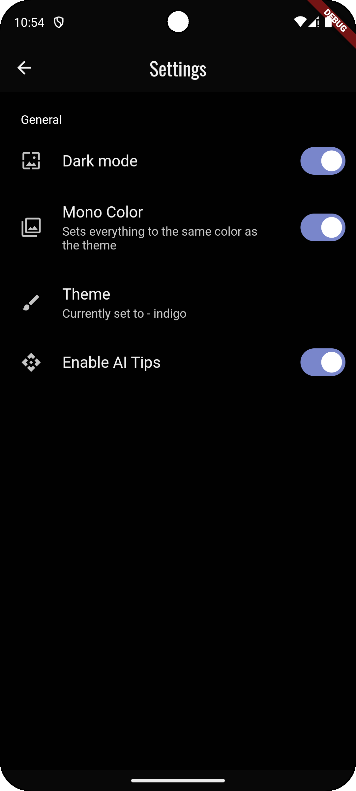

# TimeTutor

A timetable management app made using Flutter and Supabase.

## Tools and Frameworks Used
1. Flutter / Dart
2. Supabase / Postgres SQL Database
3. Supabase Auth
4. Several Flutter libraries
5. GitHub Actions for builds
6. Android Studio for Emulators (SDK 34)

## Features
1. Fully online
2. Profiles, Username, Timetable, Classes, and Institutions as separate components
3. Realtime user setting synchronization
4. Unique profile avatar generation
5. Minimalist theme with customizability
6. YAML-based timetable editing

## Screenshots

### Profile & Institution Screens

  
  
  
  
  
  
  

### Themes

  
  
  
  
  
  
  

### Timetable & Classes

  
  
  

### Expanded Timetable Views

  
  

### Home & Sign-In Screens

  
  
  
  
  

### Light Theme Screens

  
  
  

### Settings

  

