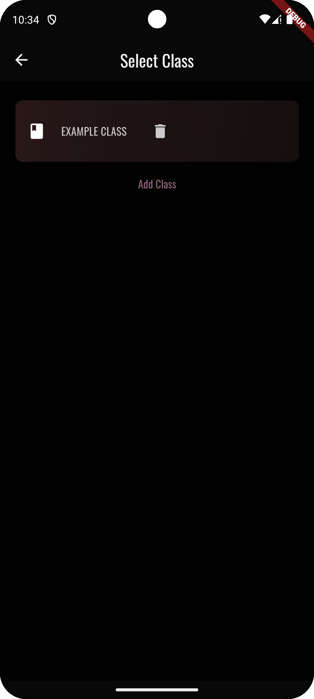
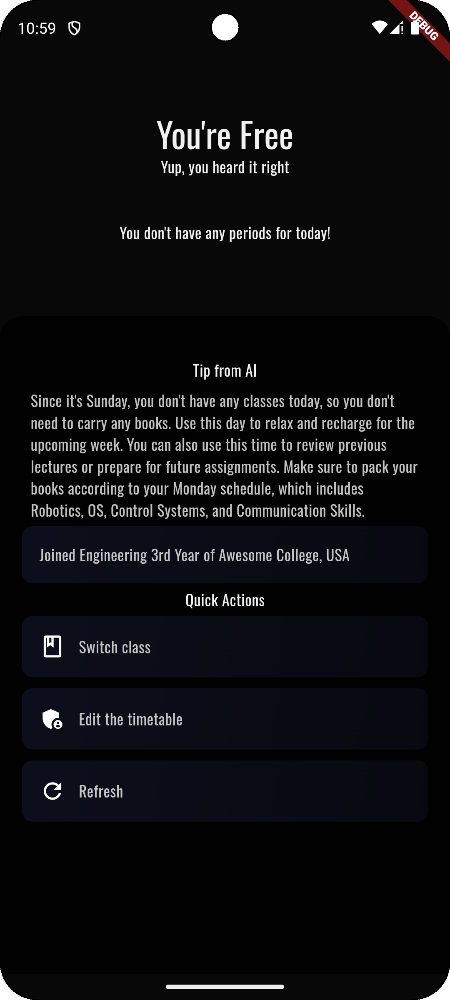

# TimeTutor

A timetable management app made using Flutter and Supabase.

## Tools and Frameworks Used

- Flutter / Dart
- Supabase / Postgres SQL Database
- Supabase Auth
- Several Flutter libraries
- GitHub Actions for builds
- Android Studio for Emulators (SDK 34)

## Features

- Fully online
- Profiles, Username, Timetable, Classes, and Institutions as separate components
- Realtime user setting synchronization
- Unique profile avatar generation
- Minimalist theme with customizability
- YAML-based timetable editing

## Videos

### Expanded Timetable Animation  
[▶ Watch Video](assets/timetable_expanded_animation_video.mp4)

https://github.com/user-attachments/assets/7833bbbc-9072-4a05-aade-aa387172ac60

### Tip Generation Animation  
[▶ Watch Video](assets/tip_generation_animation_video.mp4)

https://github.com/user-attachments/assets/c6db1c98-e16e-4b45-b2ee-598525f6f237

## Screenshots

### Profile & Institution Screens

  
  
  
  
  
  
  
  
  
  

### Themes

  
  
  
  
  
  
  

### Timetable & Classes

  
  
  

### Expanded Timetable Views

  
  

### Home & Sign-In Screens

  
  
  
  
  
  

### Light Theme Screens

  
  
  

### Tips & Animations (Screenshots)

  
  
  

### Settings

  

